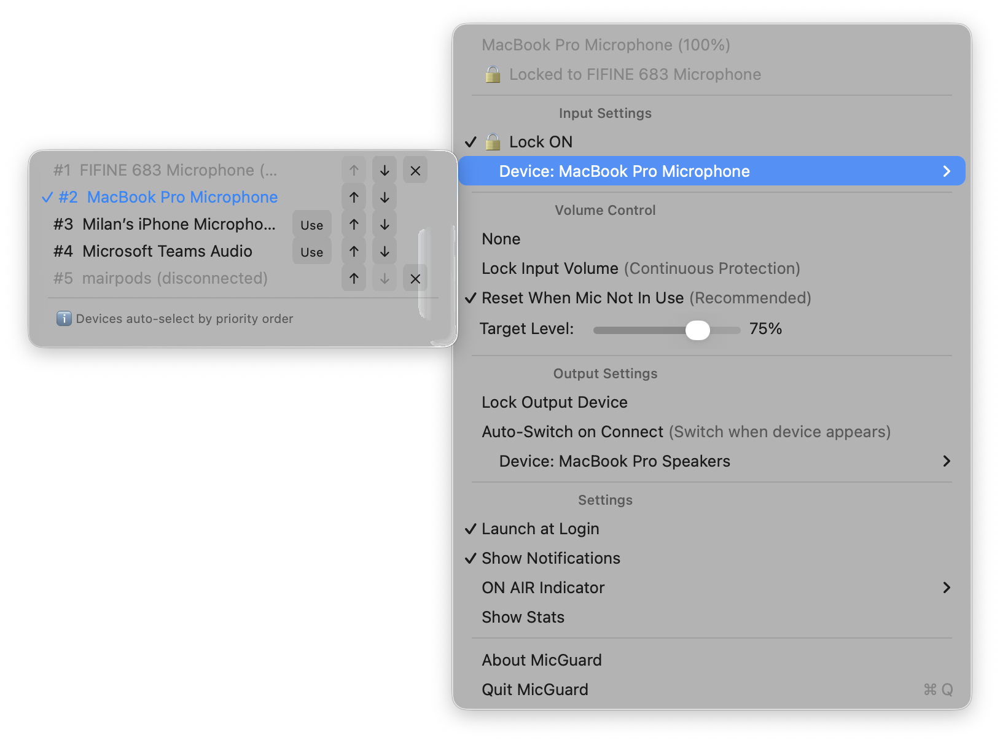

# MicGuard

Keeps your default audio device as your default audio device. macOS switches to AirPods the moment you put them on, which also drops Bluetooth audio quality to the low-bitrate call codec. MicGuard stops that.

Also handles volume - conference apps like Zoom and Meet mess with your mic volume via auto gain control. MicGuard keeps it where you set it.

Vibe-coded macOS menu bar app. Swift, no external dependencies, no network access.



## Features

- Lock preferred input/output device
- Lock mic volume or auto-reset after meetings
- Auto-switch output when preferred device connects
- ON AIR indicator when mic is active

## Install

Download the signed and notarized build from [Releases](../../releases), unzip, drag to Applications.

Or build it yourself:

```bash
swift build
# or open MicGuard.xcodeproj in Xcode
```

## Privacy

Nothing leaves your machine. No analytics, no mic access — MicGuard uses CoreAudio device metadata only, so macOS never prompts for microphone permission.

## License

Personal use only. You can use it and modify it for yourself but you can't redistribute it. See [LICENSE](LICENSE).
